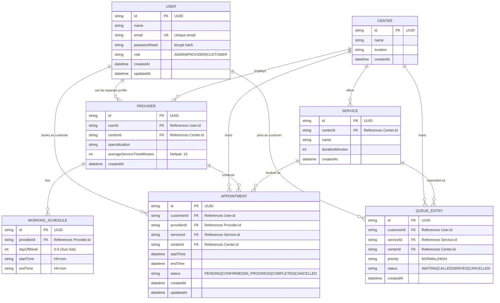

# Entity Relationship Diagram

This diagram represents the PostgreSQL database schema with all tables, primary keys, foreign keys, and cardinality relationships.

## Table Specifications

### USER
| Column | Type | Constraints |
|--------|------|-------------|
| id | UUID | PRIMARY KEY |
| name | VARCHAR | NOT NULL |
| email | VARCHAR | UNIQUE, NOT NULL |
| passwordHash | VARCHAR | NOT NULL |
| role | ENUM | ADMIN, PROVIDER, CUSTOMER (Default: CUSTOMER) |
| createdAt | TIMESTAMP | DEFAULT NOW() |
| updatedAt | TIMESTAMP | ON UPDATE |

### CENTER
| Column | Type | Constraints |
|--------|------|-------------|
| id | UUID | PRIMARY KEY |
| name | VARCHAR | NOT NULL |
| location | VARCHAR | NOT NULL |
| createdAt | TIMESTAMP | DEFAULT NOW() |

### PROVIDER
| Column | Type | Constraints |
|--------|------|-------------|
| id | UUID | PRIMARY KEY |
| userId | UUID | FOREIGN KEY → User.id, UNIQUE |
| centerId | UUID | FOREIGN KEY → Center.id |
| specialization | VARCHAR | NOT NULL |
| averageServiceTimeMinutes | INT | DEFAULT 15 |
| createdAt | TIMESTAMP | DEFAULT NOW() |

### WORKING_SCHEDULE
| Column | Type | Constraints |
|--------|------|-------------|
| id | UUID | PRIMARY KEY |
| providerId | UUID | FOREIGN KEY → Provider.id |
| dayOfWeek | INTEGER | 0-6 (Sun-Sat) |
| startTime | VARCHAR | HH:mm |
| endTime | VARCHAR | HH:mm |
*Unique constraint on (providerId, dayOfWeek)*

### SERVICE
| Column | Type | Constraints |
|--------|------|-------------|
| id | UUID | PRIMARY KEY |
| centerId | UUID | FOREIGN KEY → Center.id |
| name | VARCHAR | NOT NULL |
| durationMinutes | INTEGER | NOT NULL |
| createdAt | TIMESTAMP | DEFAULT NOW() |

### APPOINTMENT
| Column | Type | Constraints |
|--------|------|-------------|
| id | UUID | PRIMARY KEY |
| customerId | UUID | FOREIGN KEY → User.id |
| providerId | UUID | FOREIGN KEY → Provider.id |
| serviceId | UUID | FOREIGN KEY → Service.id |
| centerId | UUID | FOREIGN KEY → Center.id |
| startTime | TIMESTAMP | NOT NULL |
| endTime | TIMESTAMP | NOT NULL |
| status | ENUM | PENDING, CONFIRMED, IN_PROGRESS, COMPLETED, CANCELLED |
| createdAt | TIMESTAMP | DEFAULT NOW() |
| updatedAt | TIMESTAMP | ON UPDATE |

**Unique Constraint**: `(providerId, startTime)`

### QUEUE_ENTRY
| Column | Type | Constraints |
|--------|------|-------------|
| id | UUID | PRIMARY KEY |
| customerId | UUID | FOREIGN KEY → User.id |
| serviceId | UUID | FOREIGN KEY → Service.id |
| centerId | UUID | FOREIGN KEY → Center.id |
| priority | ENUM | NORMAL, HIGH (Default: NORMAL) |
| status | ENUM | WAITING, CALLED, SERVED, CANCELLED (Default: WAITING) |
| createdAt | TIMESTAMP | DEFAULT NOW() |

## Relationship Summary

| Relationship | Cardinality | Description |
|--------------|-------------|-------------|
| User → Provider | 1:1 | A user can have one provider profile |
| User → Appointment | 1:N | A customer can book many appointments |
| User → QueueEntry | 1:N | Users can join queue multiple times |
| Center → Provider | 1:N | A center employs multiple providers |
| Center → Service | 1:N | A center offers multiple services |
| Center → Appointment | 1:N | Appointments happen at a center |
| Center → QueueEntry | 1:N | Queue entries are managed by a center |
| Provider → WorkingSchedule | 1:N | A provider has multiple schedule entries |
| Provider → Appointment | 1:N | A provider conducts many appointments |
| Service → Appointment | 1:N | Services are booked in appointments |
| Service → QueueEntry | 1:N | A service can be requested in many queue entries |

## Index Strategy

| Table | Column(s) | Index Type | Purpose |
|-------|-----------|------------|---------|
| User | email | UNIQUE | Fast lookup for login |
| Appointment | (providerId, startTime) | UNIQUE (partial) | Prevent double-booking |
| Appointment | customerId | B-tree | Customer query performance |
| Appointment | providerId + startTime | B-tree | Schedule retrieval |
| QueueEntry | (providerId, status, joinedAt) | B-tree | Queue ordering |
| QueueEntry | customerId | B-tree | Customer queue lookup |
| WorkingSchedule | providerId | B-tree | Schedule retrieval |
