# Class Diagram

This diagram represents the backend TypeScript architecture following the layered pattern (Controller → Service → Repository/Prisma).

```mermaid
classDiagram
    direction TB

    %% Controllers
    class AuthController {
        -authService: AuthService
        +register(req, res): Promise~void~
        +login(req, res): Promise~void~
        +logout(req, res): Promise~void~
        +refreshToken(req, res): Promise~void~
    }

    class AppointmentController {
        -appointmentService: AppointmentService
        -schedulerService: SchedulerService
        +getAvailableSlots(req, res): Promise~void~
        +createAppointment(req, res): Promise~void~
        +getCustomerAppointments(req, res): Promise~void~
        +getProviderSchedule(req, res): Promise~void~
        +updateAppointmentStatus(req, res): Promise~void~
        +cancelAppointment(req, res): Promise~void~
    }

    class QueueController {
        -queueService: QueueService
        -schedulerService: SchedulerService
        +joinQueue(req, res): Promise~void~
        +getWaitTimeEstimate(req, res): Promise~void~
        +getQueuePosition(req, res): Promise~void~
        +leaveQueue(req, res): Promise~void~
        +getProviderQueue(req, res): Promise~void~
    }

    class AdminController {
        -centerService: CenterService
        -providerService: ProviderService
        -serviceService: ServiceService
        +createCenter(req, res): Promise~void~
        +addProvider(req, res): Promise~void~
        +createService(req, res): Promise~void~
        +getDashboardMetrics(req, res): Promise~void~
    }

    %% Services
    class AuthService {
        -prisma: PrismaClient
        -jwtSecret: string
        +register(data: RegisterDTO): Promise~AuthResponse~
        +login(credentials: LoginDTO): Promise~AuthResponse~
        +verifyToken(token: string): Promise~JwtPayload~
        +hashPassword(password: string): Promise~string~
        +comparePassword(password: string, hash: string): Promise~boolean~
    }

    class AppointmentService {
        -prisma: PrismaClient
        -schedulerService: SchedulerService
        +createAppointment(data: CreateAppointmentDTO): Promise~Appointment~
        +checkAvailability(providerId, startTime, endTime): Promise~boolean~
        +getAppointmentsByCustomer(customerId): Promise~Appointment[]~
        +getAppointmentsByProvider(providerId, dateRange): Promise~Appointment[]~
        +updateStatus(appointmentId, status): Promise~Appointment~
        +cancelAppointment(appointmentId): Promise~Appointment~
        -validateNoOverlap(tx, providerId, startTime, endTime): Promise~void~
    }

    class QueueService {
        -prisma: PrismaClient
        -schedulerService: SchedulerService
        +joinQueue(data: JoinQueueDTO): Promise~QueueEntry~
        +calculateWaitTime(serviceId, providerId): Promise~WaitTimeEstimate~
        +getQueuePosition(queueEntryId): Promise~number~
        +getQueueByProvider(providerId): Promise~QueueEntry[]~
        +updateQueueEntryStatus(entryId, status): Promise~QueueEntry~
        +leaveQueue(entryId): Promise~void~
        -selectBestProvider(serviceId): Promise~Provider~
    }

    class SchedulerService {
        -prisma: PrismaClient
        +getAvailableSlots(providerId, date): Promise~TimeSlot[]~
        +calculateWorkingHours(schedule, date): Promise~TimeRange~
        +isWithinWorkingHours(providerId, startTime, endTime): Promise~boolean~
        +estimateCompletionTime(providerId, currentAppt): Promise~Date~
        +generateTimeSlots(workingHours, duration, existingAppointments): TimeSlot[]
    }

    class CenterService {
        -prisma: PrismaClient
        +createCenter(data: CreateCenterDTO): Promise~Center~
        +getCenterById(centerId): Promise~Center~
        +updateCenter(centerId, data): Promise~Center~
        +getAllCenters(): Promise~Center[]~
    }

    class ProviderService {
        -prisma: PrismaClient
        +createProvider(data: CreateProviderDTO): Promise~Provider~
        +getProviderById(providerId): Promise~Provider~
        +getProvidersByCenter(centerId): Promise~Provider[]~
        +updateAvailability(providerId, schedule): Promise~WorkingSchedule~
    }

    class ServiceService {
        -prisma: PrismaClient
        +createService(data: CreateServiceDTO): Promise~Service~
        +getServiceById(serviceId): Promise~Service~
        +getServicesByProvider(providerId): Promise~Service[]~
        +updateService(serviceId, data): Promise~Service~
    }

    %% Entities (Prisma Models)
    class User {
        +id: string (PK)
        +name: string
        +email: string (unique)
        +passwordHash: string
        +role: Role (ADMIN|PROVIDER|CUSTOMER)
        +createdAt: DateTime
        +updatedAt: DateTime
    }

    class Center {
        +id: string (PK)
        +name: string
        +location: string
        +createdAt: DateTime
    }

    class Provider {
        +id: string (PK)
        +userId: string (FK)
        +centerId: string (FK)
        +specialization: string
        +averageServiceTimeMinutes: int
        +createdAt: DateTime
    }

    class WorkingSchedule {
        +id: string (PK)
        +providerId: string (FK)
        +dayOfWeek: number (0-6)
        +startTime: string
        +endTime: string
    }

    class Service {
        +id: string (PK)
        +centerId: string (FK)
        +name: string
        +durationMinutes: number
        +createdAt: DateTime
    }

    class Appointment {
        +id: string (PK)
        +customerId: string (FK)
        +providerId: string (FK)
        +serviceId: string (FK)
        +centerId: string (FK)
        +startTime: DateTime
        +endTime: DateTime
        +status: AppointmentStatus
        +createdAt: DateTime
        +updatedAt: DateTime
    }

    class QueueEntry {
        +id: string (PK)
        +customerId: string (FK)
        +serviceId: string (FK)
        +centerId: string (FK)
        +status: QueueStatus
        +priority: QueuePriority
        +createdAt: DateTime
    }

    %% Dependency Relationships
    AuthController --> AuthService : uses
    AppointmentController --> AppointmentService : uses
    AppointmentController --> SchedulerService : uses
    QueueController --> QueueService : uses
    QueueController --> SchedulerService : uses
    AdminController --> CenterService : uses
    AdminController --> ProviderService : uses
    AdminController --> ServiceService : uses

    AuthService --> PrismaClient : depends on
    AppointmentService --> PrismaClient : depends on
    AppointmentService --> SchedulerService : uses
    QueueService --> PrismaClient : depends on
    QueueService --> SchedulerService : uses
    SchedulerService --> PrismaClient : depends on
    CenterService --> PrismaClient : depends on
    ProviderService --> PrismaClient : depends on
    ServiceService --> PrismaClient : depends on

    %% Entity Relationships
    Provider "1" --> "1" User : extends
    Provider "*" --> "1" Center : belongs to
    Provider "1" --> "1..*" WorkingSchedule : has
    Provider "1" --> "*" Appointment : conducts
    Provider "*" --> "*" Service : offers

    User "1" --> "*" Appointment : "books (role=CUSTOMER)"
    User "1" --> "*" QueueEntry : "joins (role=CUSTOMER)"

    Appointment "*" --> "1" Service : references
    QueueEntry "*" --> "1" Service : references

    Center "1" --> "*" Service : provides

    %% Prisma Client
    class PrismaClient {
        <<Prisma ORM>>
        user: UserDelegate
        center: CenterDelegate
        provider: ProviderDelegate
        workingSchedule: WorkingScheduleDelegate
        service: ServiceDelegate
        appointment: AppointmentDelegate
        queueEntry: QueueEntryDelegate
        $transaction(queries): Promise
    }

    note for AppointmentService "Transaction-based booking\nwith overlap validation"
    note for QueueService "FIFO queue management\nwith dynamic wait times"
    note for SchedulerService "Slot generation and\navailability computation"
```



## Architecture Notes

| Layer | Responsibility | Key Classes |
|-------|----------------|-------------|
| **Controller** | HTTP request handling, validation, response formatting | `AuthController`, `AppointmentController`, `QueueController`, `AdminController` |
| **Service** | Business logic, transaction coordination | `AuthService`, `AppointmentService`, `QueueService`, `SchedulerService` |
| **Repository** | Database access via Prisma ORM | `PrismaClient` (generated) |
| **Entity** | Data models representing database tables | `User`, `Provider`, `Appointment`, `QueueEntry`, etc. |

### Dependency Flow

```
Controller → Service → PrismaClient → PostgreSQL
```

All services depend on `PrismaClient` for database operations. Complex business operations (e.g., booking an appointment) use Prisma's `$transaction` API for ACID compliance.
