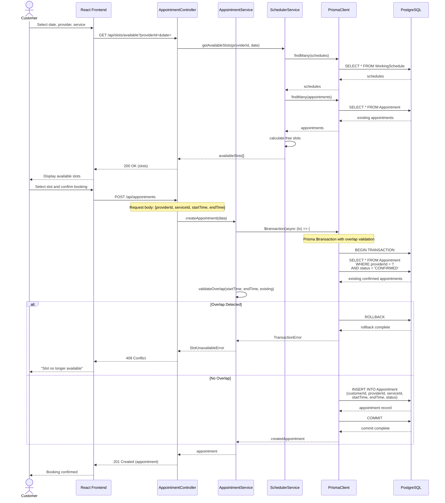
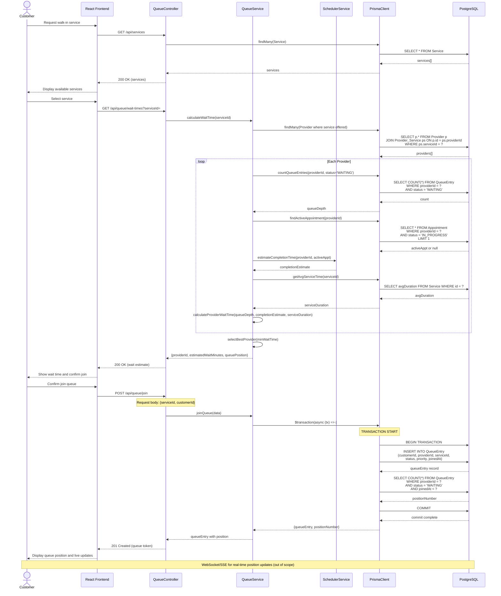

# Sequence Diagrams

## Sequence 1: Booking an Appointment

This diagram illustrates the main flow for a customer booking an appointment with transactional safety.

## Sequence 2: Walk-in Queue Join + Wait Time Calculation

This diagram shows a customer joining the walk-in queue and receiving a dynamic wait time estimate.

