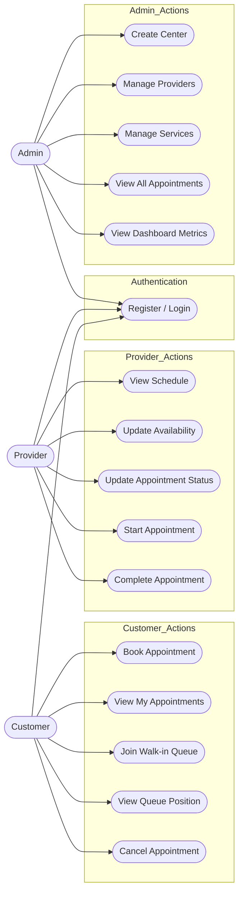

# Use Case Diagram

## Actors

| Actor | Description |
|-------|-------------|
| **Customer** | End user seeking service; books appointments or joins walk-in queue |
| **Provider** | Service provider (stylist, doctor, mechanic) who fulfills appointments |
| **Admin** | Center administrator managing resources, providers, and services |

## Use Cases by Actor

### Customer

| Use Case | Description |
|----------|-------------|
| Register/Login | Create account or authenticate with credentials |
| Book Appointment | Search available slots and reserve a time with a provider |
| View My Appointments | See list of upcoming and past appointments |
| Join Walk-in Queue | Obtain digital token for immediate queue placement |
| View Queue Position | Check current position and estimated wait time |
| Cancel Appointment | Withdraw from confirmed appointment (subject to policy) |

### Provider

| Use Case | Description |
|----------|-------------|
| View Schedule | See daily/weekly appointment calendar |
| Update Availability | Modify working hours or block time slots |
| Update Appointment Status | Change appointment state (PENDING → CONFIRMED → IN_PROGRESS → COMPLETED) |
| Start Appointment | Transition appointment state to IN_PROGRESS |
| Complete Appointment | Mark appointment as COMPLETED with notes |

### Admin

| Use Case | Description |
|----------|-------------|
| Create Center | Register new service center in system |
| Manage Providers | Add, edit, or deactivate provider accounts |
| Manage Services | Create, update, or remove service offerings |
| View All Appointments | Monitor appointments across all providers |
| View Dashboard Metrics | Access analytics on utilization, wait times, no-shows |

## Use Case Diagram (Mermaid)

